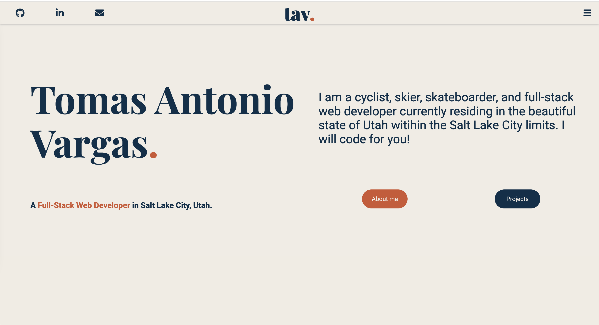

# Portfolio Website (v1.0)

## Description

This my developer portfolio I built using only HTML and CSS. 

## Installation

Head over to the link to see the deployed web app ---> <a href="https://tavargas9.github.io/portfolio/">tavargas9.github.io</a>

## Usage

Scroll through the page or hit the links to see my about me info, projects, my skillset and the projects I have made!

## Credits

Thanks to <a href="https://github.com/necolas">Necolas</a> for the <a href="https://github.com/necolas/normalize.css"> Normalize.css</a> file.

## License

Please refer to the LICENSE in the repo.

